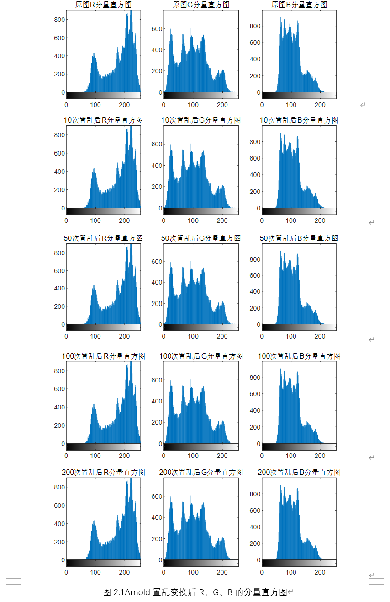
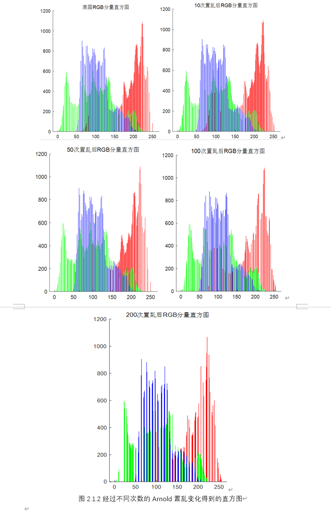
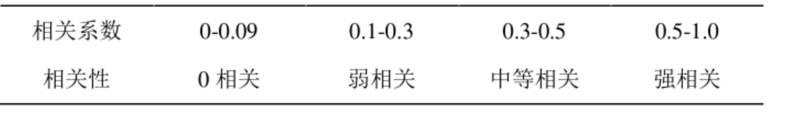
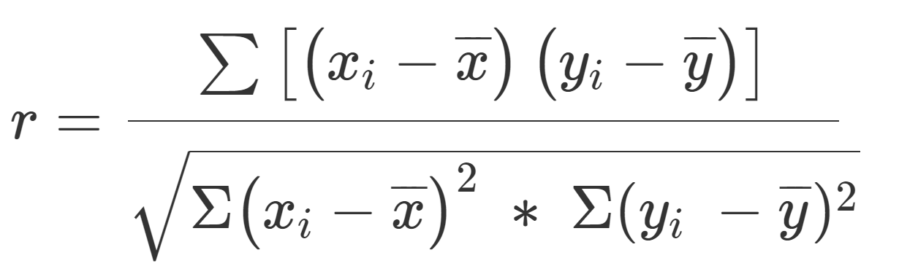
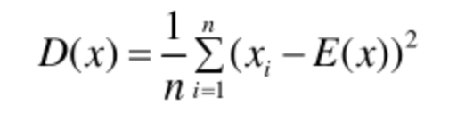
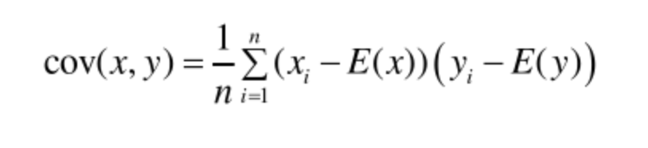
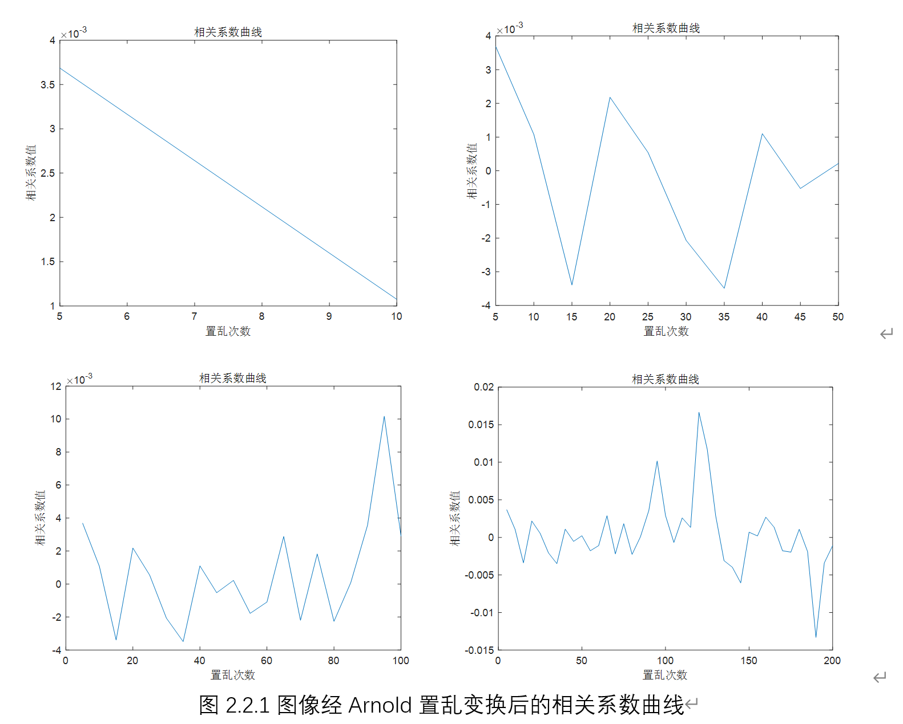
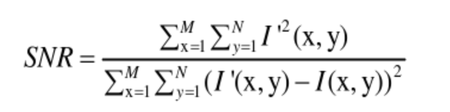
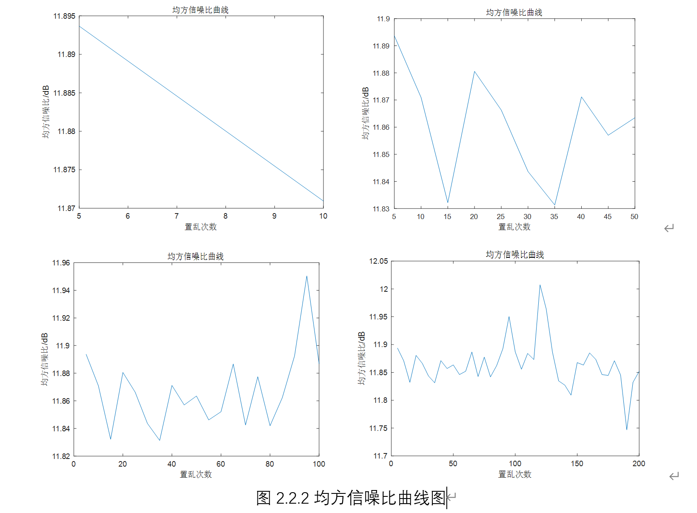

# 实验一 Arnold置乱变换图像加密实验


## 实验目的

- 熟悉Arnold置乱变换图像加密相关理论和算法
- 实现Arnold置乱变换图像对图片完成加密
- 实现Arnold置乱的逆置乱变换完成对图片的解密
- 测试Arnold置乱变换图像的相关性能指标

## 实验环境

- MatlabR2021a
- Windows11

## 实验图像

- lena256.png

## 实验内容

1. 实现Arnold置乱变换对图像进行加密
1. 通过逆置换实现对加密图像的还原
1. 对Arnold置乱加密的图像进行性能指标测试，包括对于相关性以及均方信噪比的数据分析，分析影响Arnold置乱变换效果的指标因素

## 实验步骤

### 1、读取图像，并对图像进行Arnold置乱变换加密和逆置乱解密

#### 1.1使用matlab自带的imread函数读取图像，同时使用imresize函数调整图像大小为256*256

```matlab
clear all;close all;clc;
I=imread('lena256.png');
I=imresize(I,[256,256]);
```

#### 1.2使用matlab内置的subplot函数和imshow函数分别以R、G、B三个分量分理出图像

```matlab
figure(1);
subplot(1,4,1);imshow(I,[]);title('原图');
subplot(1,4,2);imshow(I(:,:,1),[]);title('R');
subplot(1,4,3);imshow(I(:,:,2),[]);title('G');
subplot(1,4,4);imshow(I(:,:,3),[]);title('B');
```


#### 1.3编写Arnold变换函数，分别对原图以及RGB三个灰度图像都进行Arnold置乱变换

##### 1.3.1 实验原理

Arnold 变换，又称为 cat 映射。该变换的本质操作是拉伸和折叠，通过这两种操作可以改变图像内各像素点的空间位置，破环像素点之间原来的关联，降低像素点之间的相关性。传统的 Arnold 变换矩阵形式可表示为：

 

其中(1112)为变换矩阵，取模 mod(1)表示只取小数点后面的有效数字，可理解为 x mod(1)=x-⌊x⌋（⌊⌋为向下取整运算符），故（x',y'）所有可能状态的空间（相空间）被有效地限制在[0,1]×[0,1]的单位正方形内。

##### 1.3.2Arnold置换加密过程

- **用`size（）`函数获取矩阵的行数和列数，同时将返回值返还给由`zeros（）`函数生成的全零数组中，再设置i，j两个计数器进行遍历循环对图像矩阵进行遍历，对行列获取的值进行取模运算，输出结果。**

```matlab
function [ out ] = arnold( in, iter )%Arnold变换置乱  
    [m n] = size(in);
    out = zeros(m);
    n = n - 1;
    for j=1:iter
        for y=0:n
            for x=0:n
                p = [ 1 1 ; 1 2 ] * [ x ; y ];
                out(mod(p(2), m)+1, mod(p(1), m)+1) = in(y+1, x+1);
            end
        end
        in = out;
    end
end
```


可以看到置乱的次数越多，图像加密效果越好，使得能够更好的保证图像的保密性。

#### 1.4编写iArnold函数实现Arnold置乱的反置乱，还原加密图像

##### 1.4.1实验原理

Arnold 变换的解密手段分作两种：一是采用周期性，二是采用可逆性。可逆性是指 Arnold 变换具有逆变换公式，变换 n 次后的图像利用逆变换反向变换 n 次即可得到解密图像；周期性是指图像经过一定次数的变换后能够得到一幅与原始图像一致的图像，假设图像 **I0**的变换周期为 T，**I1**是n(0<n<T)次变换后的图像，**I2**是再经（T-n）次变换的图像，此时 **I2**= **I0**，**I2**即为解密图像。就周期性而言，非等长变换需要约束变换矩阵的参数才存在，等长变换则不需要约束条件也存在周期。

Arnold变换的定义为:


其中(x, y)是原图像的象素点, (x 0 , y0 )是变换后新图像的象素点, n是图像的阶数, 即图像的大小, 这里考虑的是正方形图像. 对于当前图像, (x 0 , y0 )和n为已知, (x, y)而是未知的. 由Arnold变换的定义式可知


这意味着存在整数p, q使得


即


方程组有无数多组解, 但是在图像处理的背景下, 却能得到其惟一解. 因为如下条件:


成立, 所以


再由不等式的性质以及图像处理的背景可推出p, q非负, 从而


故p只能取0和1, q只能取0, 1, 2.于是可得到2 × 3 = 6个方程组.逐一求解方程组相当麻烦, 当维 数增大时更为复杂, 因此应充分利用图像的性质来确定p和q的值, 以下为分析求解过程

有0 ≤ (x + 2y) − (x + y) = y = y 0 − x 0 + (q − p)n ≤ n − 1,因此可根据x 0 , y0的 情况具体判别.

1. x 0 ≤ y 0 , 则y 0 −x 0 ≥ 0,从而有p = q, 故y = y 0 −x 0 .若x 0 < y,则x = n+x 0 −y;否则x = x 0 −y. 
2. x 0 > y0 , 则y 0 − x 0 < 0,从而有q = p + 1, 故y = n + y 0 − x 0 .同理可求x.

由于Arnold变换是一个双射, 以上所求则为它的逆映射, 于是解集一定在原图像支集范围 内, 并且刚好填满该支集. 由于正, 反变换是相对的, 故可把本文算法求出的反变换作为正变换, 则相应的反变换就是Arnold变换

##### 1.4.2Arnold的反置乱算法

- **此处同样使用读取矩阵遍历的方式对变换后的图像进行不同分量的解密，同时根据上述的Arnold的置乱加密方式进行周期性恢复图像**

```matlab
%反置乱
function [ out ] = iarnold( in, iter )
   
    [m n] = size(in);
   
    out = zeros(m);
    n = n - 1;
    for j=1:iter
        for y=0:n
            for x=0:n
                p = [ 2 -1 ; -1 1 ] * [ x ; y ];
                out(mod(p(2), m)+1, mod(p(1), m)+1) = in(y+1, x+1);
            end
        end
        in = out;
    end
end
```


应用Arnold变换于图像加密时, 一般采用做法是：首先用Arnold变换对图像进行预处理, 然后再对预处理的前期结果采用各种不同的方法进一步加密. 解密时, 同样分两步进行处理, 第一步的解密方法依赖于加密第二步所采用的方法, 而第二步均为利用Arnold变换的周期性进行恢复。

### 2、对Arnold置乱变换加密过程的指标分析

#### 2.1显示Arnold置乱变换加密图像的灰度直方图

##### 2.1.1R、G、B对应的分量直方图

- **使用内置的直方图`imhist()`函数,分别输出对应的不同次数置乱得到的R、G、B三个灰度分量对应的分量直方图**

```matlab
%输出R、G、B分量对应的分量直方图
figure(5);
% subplot(3,4,5);imhist(C);title('彩图扩散直方图');
subplot(2,3,1);imhist(C(:,:,1));title([num2str(num) '次置乱后R分量直方图']);
subplot(2,3,2);imhist(C(:,:,2));title([num2str(num) '次置乱后G分量直方图']);
subplot(2,3,3);imhist(C(:,:,3));title([num2str(num) '次置乱后B分量直方图']);
% subplot(3,4,9);imhist(I1);title('原彩图扩散直方图');
subplot(2,3,4);imhist(I(:,:,1));title('原图R分量直方图');
subplot(2,3,5);imhist(I(:,:,2));title('原图G分量直方图');
subplot(2,3,6);imhist(I(:,:,3));title('原图B分量直方图');
```




##### 2.1.2得出Arnold置乱变换加密图像的直方图

此处采用Matlb的函数库中的另一个函数`histogram()`来生成对应的直方图，根据官方文档，**histogram的NumBins值可以人为设定**，在未指定该参数时，系统将基于图像的灰度分布自动计算NumBins的值。

再用`num2str()`将数值转化为字符数组输出。

```matlab
%输出置乱加密后图像的直方图
%FaceColor - 面颜色
%EdgeColor - 边颜色
%FaceAlpha - 面透明度
figure(6);
subplot(1,2,2);
histogram(C(:,:,1),512,'Facecolor','r','FaceAlpha',1,'Edgecolor','none');title([num2str(num) '次置乱后RGB分量直方图']);
hold on
histogram(C(:,:,2),512,'Facecolor','g','FaceAlpha',1,'Edgecolor','none');
hold on
histogram(C(:,:,3),512,'Facecolor','b','FaceAlpha',1,'Edgecolor','none');
box off;
subplot(1,2,1);
histogram(I(:,:,1),512,'Facecolor','r','FaceAlpha',1,'Edgecolor','none');title('原图RGB分量直方图');
hold on
histogram(I(:,:,2),512,'Facecolor','g','FaceAlpha',1,'Edgecolor','none');
hold on
histogram(I(:,:,3),512,'Facecolor','b','FaceAlpha',1,'Edgecolor','none');
box off;
```



**分析**

对比不同次数置乱的直方图，与原图进行对照比较，可以清楚看到，在置乱次数较少时，图像未被充分加密，对比原始图像，还有很多相似的特征，对比加密前后的灰度直方图，像素值经位运算变换后发生了改变，灰度直方图的分布趋向于均匀化，因此在置乱次数达到一定值的时候，得到的直方图更加分布集中，加密后的灰度值峰值起伏较大，而且较为集中，这样证明了置乱的效果，已经改变了像素值，不容易攻击，因为攻击分散在每个像素点，可见该算法的抗攻击性较强。

#### 2.2对置乱后的图像进行相关性分析和置乱度分析

##### 2.2.1对置乱后的图像的相关性分析

相关性[在数字图像领域指的是像素点之间的线性关系，相关系数为表征像素点的相关性的具体参数，表 2.2.1 为相关系数与相关性的对应关系。 



数字图像内，相关性体现在水平、垂直、对角线三个方向，一幅正常图像中像素点之间在这三个方向的相关系数一般在 0.5~1.0 之间，属于强相关，加密后的图像的相关系数应该在 0.3 左右，也就是弱相关甚至 0 相关，当加密图像像素点之间的相关系数降低至 0 左右，从相关性的角度图像得到了充分置乱。

**（1）相关系数计算公式：**



**（2）方差计算公式：**



**（3）协方差计算公式：**



**（4）期望的计算公式：**


**最终我们得到不同次数置乱变换后的相关系数曲线：**



##### 2.2.2对置乱后的图像的均方信噪比分析

信噪（SNR (Single-Noise Ratio)），表示的是信号与噪声之比。设原始图像为 I，置乱图像为 I'，均方信噪比定义为：



根据公式，分子是置乱图像所有像素点值的平方和，分母是置乱图像与原始图像像素点值相减之后的平方和，则可以将分母看成是噪声图像所有像素点值的平方和，因此可以得到如下推论：置乱图像的噪声越大，SNR 越小；噪声越小，SNR 越大。故，SNR 越小，置乱度越高。 



**分析**

跟据曲线图得到表中数据

| 置乱次数  | 均方信噪比 |
| :-------: | :--------: |
|   原图    |  11.8937   |
| 置乱10次  |  11.8709   |
| 置乱50次  |  11.8635   |
| 置乱100次 |  11.8689   |
| 置乱200次 |  11.8521   |

理论上，置乱图像的噪声越大，SNR 越小；噪声越小，SNR 越大。故均方信噪比（SNR） 越小，置乱度越高，加密效果越好。

而根据表中实际数据可以总结 Arnold 变换及其相关性评价可以发现： 
（1）SNR 不能很好的反映 Arnold 变换置乱图像时置乱度的变换，比较而言，相关性比 SNR 更能反映图像的置乱程度。 
（2）传统 Arnold 变换用于图像加密时，要想取得好的置乱效果往往需要经过多次迭代变换，但是随机迭代次数的增加，相关系数会出现反弹现象。 

**结合相关性、均方信噪比及图像加密效果，对于本次测试来说，传统 Arnold变换迭代 200 次时置乱效果最佳**


## 实验总结

通过本次实验，对Arnold置乱变换算法的理解提升了很大的一个层次，能够清楚地意识到Arnold置乱加密算法对于图像的加密具体实现的原理和效果，同时也学会了用相关曲线和均方信噪比去衡量算法指标，如何根据数据去分析影响Arnold置乱变换算法的因素，同时也使得本人从一个Matlab完全不清楚的门外汉到一个Matlab的一个初学者，体会到了Matlab在图像处理分析领域功能的强大，收获颇丰。

## 参考资料

[1]方毅.Arnold置乱变换图像加密算法研究【D】.计算机软件与理论.2018-06-16

[2]孔涛.张亶.Arnold反变换的一种新算法【N】.软件学报.2004-04

[3]詹新生.图像加密置乱性能分析【D】.计算机软件及计算机应用.2005-07-16

[4]CSDN.SNR、PSNR、MSE分析【EB/OL】.2019-09-23

[5]CSDN.去噪效果评价算法分析，SNR,PSNR,SSIM等的区别与优劣对比【EB/OL】.2017-08-02
